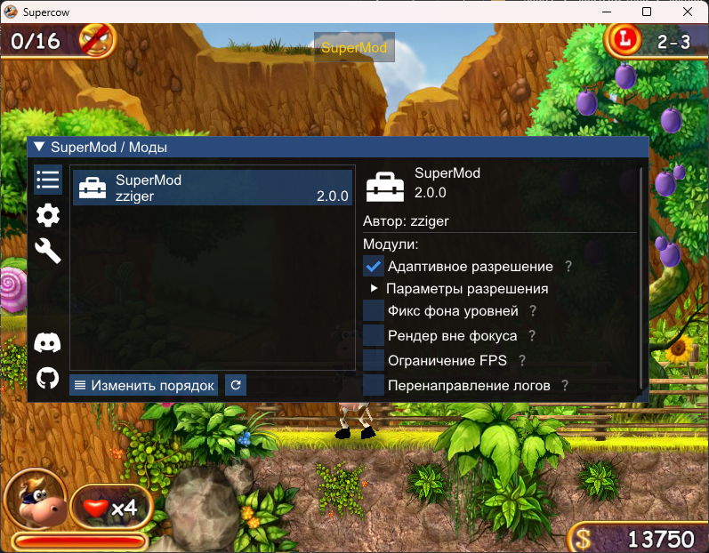

# SuperMod - Мод на игру "Супер Корова" (Nevosoft)

| [**Download / Скачать**](https://github.com/zziger/supercow-mod/releases/latest/download/dinput8.dll) | [**Discord сервер**](https://discord.gg/VerZycPqhS) |
|-------------------------------------------------------------------------------------------------------|-----------------------------------------------------|

## Установка

- Скачать последнюю версию мода [**тут**](https://github.com/zziger/supercow-mod/releases/latest/download/dinput8.dll).
- Поместить скачанный файл `dinput8.dll` в папку с игрой. Название файла менять нельзя.

> ⚠️ **В пути к игре не должно быть букв русского алвафита.**

## Функционал

### Модлоадер

- Перезагрузка ресурсов без рестарта игры (хотсвап)
- Lua API
- C++ API
- Исправляет загрузку некоторых ассетов в нестандартном разрешении (например, `loadscreen.jpg`)
- Позволяет загружать [дополнительную музыку для уровней](https://github.com/zziger/supercow-mod/wiki/%D0%9C%D0%BE%D0%B4%D0%BB%D0%BE%D0%B0%D0%B4%D0%B5%D1%80#%D1%80%D0%B0%D1%81%D1%88%D0%B8%D1%80%D0%B5%D0%BD%D0%B8%D1%8F-%D1%84%D1%83%D0%BD%D0%BA%D1%86%D0%B8%D0%BE%D0%BD%D0%B0%D0%BB%D0%B0-%D0%BC%D0%BE%D0%B4%D0%B4%D0%B8%D0%BD%D0%B3%D0%B0)
- Позволяет загружать [дополнительные граунды для уровней](https://github.com/zziger/supercow-mod/wiki/%D0%9C%D0%BE%D0%B4%D0%BB%D0%BE%D0%B0%D0%B4%D0%B5%D1%80#%D1%80%D0%B0%D1%81%D1%88%D0%B8%D1%80%D0%B5%D0%BD%D0%B8%D1%8F-%D1%84%D1%83%D0%BD%D0%BA%D1%86%D0%B8%D0%BE%D0%BD%D0%B0%D0%BB%D0%B0-%D0%BC%D0%BE%D0%B4%D0%B4%D0%B8%D0%BD%D0%B3%D0%B0)
- Ограничение поддерживаемых [версий игры](https://github.com/zziger/supercow-mod/wiki/%D0%9C%D0%BE%D0%B4%D0%BB%D0%BE%D0%B0%D0%B4%D0%B5%D1%80#%D0%B2%D0%B5%D1%80%D1%81%D0%B8%D0%B8-%D0%B8%D0%B3%D1%80%D1%8B) до выбранных

### Встроенные функции

- Разрешает запускать больше одной копии игры одновременно
- Исправляет "зависание" окна во время загрузки игры
- Разрешает игре рендериться в правильном разрешении окна, или любом другом произвольном разрешении (опционально)
- Разрешает отключить или перенаправить логи игры (опционально)
- Разрешает ограничить FPS (пока не работает корректно, опционально)
- Исправляет иногда пропадающие фоны уровней (опционально)
- Разрешает игре рендериться, когда окно не в фокусе (опционально)

## Сборка

Требования для сборки:

- Visual Studio Build Tools, рекомендуемо v143
- Windows SDK
- CMake 3.15 или новее

Для сборки нужно выполнить [`build.bat`](build.bat) в корне проекта. 
Итоговая DLL будет находиться по пути `BUILD\Release\dinput8.dll`

## Лицензия

[MIT](LICENSE)

## Contributions

Если нужен какой-то новый функционал - PR приветствуются. 